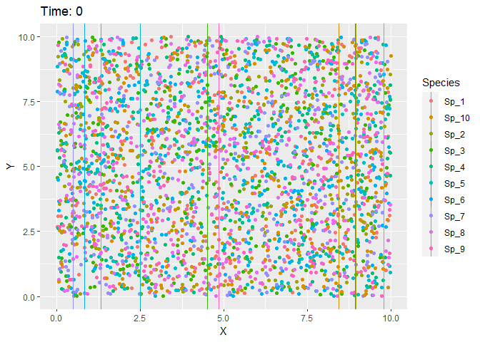

```{r setup, include=FALSE}
knitr::opts_chunk$set(echo = TRUE)
```

\clearpage

# Introduction

## Scientific Goals
Throughout this document, Anna Vinton and I, Erik Kusch, build a data simulation framework for assessment of performance of ecological network inference frameworks. This simulation framework will additionally be used to attempt to improve on pre-existing ecological network inference methodology.

The final simulation function will be characterised by:

1. **Input** - a network of species and their interactions
2. **Process** - the *input* is used to:  
    a. generate virtual species corresponding to nodes in the *input*  
    b. generate individuals for each virtual species with a unique trait value, location  
    c. generate a spatial product of environmental parameters for the individuals of all species to inhabit  
    d. place individuals of all virtual species into the environment  
    e. simulate population growth/decline using a dynamic death rate driven by mismatches in trait- and environment-values as well as spatially explicit effects of species interactions  
3. **Output** - time series of population sizes of each species at each time-step of the simulation

## `R` Preprations
For the following, we require some packages - mostly for visualisations. These are:
```{r, packages}
library(ggplot2) # for visualisations
library(cowplot) # for combining plots
```

\clearpage

# Building the Simulation

Here, I document how the simulation is built up piece-by-piece. 

## One-Species Through Time

The base code for this part of the simulation, we have adapted from course material provided on-line by [Dan McGlinn](https://dmcglinn.github.io/quant_methods/lessons/simulations.html). This simulation represents a basic **simple model of logistic growth**:
```{r}
dNt <- function(r, # population growth rate
                Nt, # population size
                k # carrying capacity
                ){ r * Nt * (k - Nt)}
```

With this approach, a population will increase in size towards the carrying capacity if its starting population size ($N_0$) $N_0<k$. If $N_0>k$ the population size will decrease towards the carrying capacity. 

This function now needs to be iterated over time:
```{r}
SIM.Nt <- function(r, N_0, t, k) {
  N <- N_0 # registering starting population size as a new object
  for(i in 1:(t - 1)){ # loop over time-steps specified
    # identify new population size given logistic growth
    N[i + 1] <- N[i] + dNt(r = r, Nt = N[i], k = k) 
  } # end of time-step loop
  N # return population size vector
}
```

Now, we execute this function with a few different settings to see the effects they are having:
```{r}
SIM_Growth <- SIM.Nt(N_0 = 0.1, t = 100, r = 0.1, k = 1) # N_0 < k --> growth
SIM_Decline <- SIM.Nt(N_0 =  1.9, t = 100, r = 0.1, k = 1) # N_0 > k --> decline
SIM_Rapid <- SIM.Nt(N_0 =  0.1, t = 100, r = 0.9, k = 1) # high population growth rate
SIM_Slow <- SIM.Nt(N_0 =  0.1, t = 100, r = 0.05, k = 1) # low population growth rate
```

```{r, echo = FALSE, fig.height = 7}
plot_df <- data.frame(
  N = c(SIM_Growth, SIM_Decline, SIM_Rapid, SIM_Slow),
  t = rep(1:100, 4),
  Run = rep(c("Growth", "Decline", "Rapid", "Slow"), each = 100)
)
ggplot(plot_df, aes(x = t, y = N)) + 
  geom_line() + 
  facet_wrap(~Run, scales = "free_y") + 
  theme_bw()
```

The approach behaves as expected by us!

\clearpage

## Indidividuals in Simulation

Next, we make the simulation more complex by running it for multiple individuals of one species. To do so, we require a new function that determines what happens at each time step:
```{r}
dt <- function(b0, # background birth rate
               d0, # background death rate
               k, # carrying capacity
               N
               ){d0 + N * (b0 - d0)/k}
```
This function will build the backbone for our more complex simulations. It represents a **dynamic death rate**. Given a static birth rate and carrying capacity, it takes into account current population size and a background death rate to calculate a probability of death for each individual. You will see that this function cannot differentiate between individuals as it is not supplied with any individual-level characteristics yet. We will add this functionality in our next development step. For now, `dt()` calculates the same death probability for each individual alive at each time step.

**Note that** $b_0+d_0=1$ **!**

Let's iterate all of this over time:
```{r}
SIM.Ind <- function(tsteps, # how many time steps to simulate for
                      d0, # background death rate
                      b0, # background birth rate
                      k, # carrying capacity
                      ID_df # data frame containing individuals
){
  ## object creation
  ### data frame to hold population level data
  Pop_df <- data.frame(N = nrow(ID_df), t = NA)
  ### progress bar
  pb <- txtProgressBar(max = (tsteps-1), style = 3)
  ## simulation loop over time steps
  for(t in 1:(tsteps-1)){
  Pop_df$t[t] <- t # save time to population data frame
  ### vectors for storing birth and death probabilities for each individual
  birth_prob <- rep(NA, nrow(ID_df))
  death_prob <- rep(NA, nrow(ID_df))
  ### loop over all individuals alive at time t
  for(i in 1:nrow(ID_df)){
    birth_prob[i] <- b0
    death_prob[i] <- dt(b0, d0, k, Pop_df$N[t])
  }
  names(birth_prob) <- names(death_prob) <- ID_df$ID
  ### identify which event happens, only one birth or death per timestep
  EventSample_vec <- paste( # a vector of Birth/Death and individual ID
    rep(c("Birth", "Death"), each = nrow(ID_df)), 
    names(birth_prob), sep="_")
  event <- sample( # sample from event possibilities according to probabilities
    EventSample_vec,
    size = 1,
    prob = c(birth_prob, death_prob)
  )
  ### event evaluation
  event_eval <- strsplit(event, split = "_") # identifiers for event
  event_EV <- event_eval[[1]][1] # what is happening?
  event_ID <- event_eval[[1]][2] # which individual is it happening to?
  #### Birth event
  if(event_EV == "Birth"){ # currently, basically cloning
    append_df <- ID_df[ID_df$ID == event_ID, ] # subset for individual 
    append_df$ID <- max(ID_df$ID)+1 # assign new ID
    ID_df <- rbind(ID_df, append_df) # copy ID row to ID_df
  }
  #### Death event
  if(event_EV == "Death"){
    ID_df <- ID_df[ID_df$ID != event_ID, ] # delete individual from ID_df
  }
  ### recalculate population size
  Pop_df <- rbind(Pop_df, data.frame(N = nrow(ID_df), t = t+1))
  ### update progress bar
  setTxtProgressBar(pb, t) 
  ### check if population has gone extinct
  if(Pop_df$N[t+1] == 0){warning("Population went extinct"); break} 
  } # end of simulation loop
  ## return of data objects
  return(list(Individuals = ID_df, Populations = Pop_df))
}
```

Again, we execute this function with a few different settings to see the effects they are having:
```{r, message=FALSE, fig.keep="all", results="hide", warning=FALSE}
ID_df <- data.frame(ID = 1:10, Sp = rep("Sp1")) # we run this simulation for 7 individuals
Sim_Growth <- SIM.Ind(tsteps = 3e3, b0 = 0.7, d0 = 0.3, k = 100, ID_df = ID_df) # growth
Sim_Decline <- SIM.Ind(tsteps = 3e3, b0 = 0.4, d0 = 0.6, k = 100, ID_df = ID_df) # decline
Sim_Rapid <- SIM.Ind(tsteps = 3e3, b0 = 0.9, d0 = 0.1, k = 100, ID_df = ID_df) # fast
Sim_Slow <- SIM.Ind(tsteps = 3e3, b0 = 0.55, d0 = 0.45, k = 100, ID_df = ID_df) # slow
```

```{r, echo = FALSE, fig.height = 3.5}
plot_df <- rbind(Sim_Growth$Populations,
                 Sim_Decline$Populations,
                 Sim_Rapid$Populations,
                 Sim_Slow$Populations)
plot_df$Run <- rep(c("Growth", "Decline", "Rapid", "Slow"), 
                   c(nrow(Sim_Growth$Populations), 
                     nrow(Sim_Decline$Populations),
                     nrow(Sim_Rapid$Populations),
                     nrow(Sim_Slow$Populations)
                   ))
ggplot(plot_df, aes(x = t, y = N)) + 
  geom_line() + 
  facet_wrap(~Run, scales = "free_y") + 
  theme_bw()
```

Unsurprisingly, our simulations worked once more as expected!

\clearpage
## Spatial Component \& Traits

Next, we implement the effects of the environment onto the dynamic death rate. This effect is calculated from the mismatch of an individuals trait value (`Tr`) and the singular value of the environment (`Env`). The severity of this effect is given by:

\begin{equation}
\frac{e^{(Tr-Env)^2}}{sd}
\end{equation}

As can be seen from the above, the effect of the mismatch is modulated by an additional argument - `sd`. This can be understood as the niche breadth of each individual. The larger this number, the lower the impact of environment-trait mismatch.

Consequently, we update the dynamic death rate function `dt()` as follows:
```{r}
dt <- function(b0, d0, k, N, Tr, Env, sd){d0 + N * exp((Tr-Env)^2)/sd * (b0 - d0)/k}
```

Now that we implement traits and environmental effects, we also need to derive environmental conditions. For the time being, we do so using a linear function in one dimension:
```{r}
env.xy <- function(x = NULL){x}
```

Let's put this all together and iterate over simulation steps. From now on, I will only highlight bits where a function and its argument changes when compared to previous versions:
```{r}
SIM.Ind <- function(tsteps = 3e3, d0 = 0.2, b0 = 0.8, k = 100,
                    sd = 1, # niche breadth
                    ID_df = NULL # now needs to contain locations and trait values
){
  ## object creation
  ### data frame to hold population level data
  Pop_df <- data.frame(N = nrow(ID_df), 
                       Gridcell = NA, # gridcell binning is not implemented yet
                       t = NA)
  ### progress bar
  pb <- txtProgressBar(max = (tsteps-1), style = 3)
  ## simulation loop over time steps
  for(t in 1:(tsteps-1)){
  Pop_df$t[t] <- t 
  ### vectors for storing birth and death probabilities for each individual
  birth_prob <- rep(NA, nrow(ID_df))
  death_prob <- rep(NA, nrow(ID_df))
  ### loop over all individuals alive at time t
  for(i in 1:nrow(ID_df)){
    birth_prob[i] <- b0
    death_prob[i] <- dt(b0 = b0, d0 = d0, k = k, N = Pop_df$N[t],
                         Tr = ID_df$Trait[i], # trait value of individual i
                         Env = env.xy(x = ID_df$Location[i]), # environment at location[i] 
                         sd = sd)
  }
  names(birth_prob) <- names(death_prob) <- ID_df$ID
  ### identify which event happens, only one birth or death per timestep
  EventSample_vec <- paste(rep(c("Birth", "Death"), each = nrow(ID_df)), 
                           names(birth_prob), sep="_")
  event <- sample(EventSample_vec, size = 1, prob = c(birth_prob, death_prob))
  ## event evaluation
  event_eval <- strsplit(event, split = "_")
  event_ID <- event_eval[[1]][2]
  event_EV <- event_eval[[1]][1]
  if(event_EV == "Birth"){
    append_df <- ID_df[ID_df$ID == event_ID, ]
    append_df$ID <- max(ID_df$ID)+1
    ## individuals now resettle somewhere around their parent-individual
    movement <- rnorm(1, 0, 1) # this needs more parametrisation in future versions
    append_df$Location <- append_df$Location+movement
    ID_df <- rbind(ID_df, append_df)
  }
  if(event_EV == "Death"){
    ID_df <- ID_df[ID_df$ID != event_ID, ]
  }
  ## recalculate population size
  Pop_df <- rbind(Pop_df, data.frame(N = nrow(ID_df), Gridcell = NA, t = t+1))
  setTxtProgressBar(pb, t)
  if(Pop_df$N[t+1] == 0){warning("Population went extinct"); break}
  }
  return(list(Individuals = ID_df, Populations = Pop_df))
}
```

Now let's create a data frame with IDs, trait values, and locations. This time, we start with a much bigger starting population to make sure our randomly chosen traits and locations align for at least some individuals in such a way that our entire population doesn't collapse right away:
```{r}
# data frame of individuals at start of simulation
ID_df = data.frame(ID = 1:1e3,
                   Trait = NA,
                   Location = NA)
# dummy values for traits
set.seed(42)
ID_df$Trait <- runif(n = nrow(ID_df), min = 0, max = 10)
# dummy locations
set.seed(42)
ID_df$Location <- runif(n = nrow(ID_df), min = 0, max = 10)
```

The big question we have to answer with this new simulation is how to parametrise the `sd` argument, so let's run the simulation with the same starting individuals with different values of `sd`:
```{r, message=FALSE, fig.keep="all", results="hide", warning=FALSE}
SIM_0.5 <- SIM.Ind(sd = 0.5, # strong impact of environment
                      ID_df = ID_df)
SIM_1 <- SIM.Ind(sd = 1, # intermediate impact of environment
                      ID_df = ID_df)
SIM_2 <- SIM.Ind(sd = 2, # weaker impact of environment
                      ID_df = ID_df)
SIM_10 <- SIM.Ind(sd = 10, # very weak impact of environment
                      ID_df = ID_df)
```

To assess the effect, we now look at how strongly traits track the environment in the outputs

```{r, echo = FALSE, fig.height = 7.5}
df0.5 <- SIM_0.5$Individuals
df1 <- SIM_1$Individuals
df2 <- SIM_2$Individuals
df10 <- SIM_10$Individuals
df0.5$sd <- 0.5
df1$sd <- 1
df2$sd <- 2
df10$sd <- 10
plot_df <- rbind(df0.5, df1, df2, df10)
ggplot(plot_df, aes(x = Location, y = Trait)) +
  geom_point() +
  facet_wrap(~sd) + 
  theme_bw()
```

As we can see, setting `sd = 0.5`, all of our original individuals go extinct due to environment-trait mismatches except for one individual which ends up cloning itself and distributing itself around the same value in the environment as its trait (i.e. it's niche optimum). At `sd = 1`, some distinct individuals and trait profiles are present in our final population. As we increase `sd` further, the trait space and environmental spectrum are populated more densely. 

\clearpage

## Adding a Second Species

As we add a second species to our simulation, we do not take into account any specific interaction signs, strength, or spatial effect thereof. For now, our two species will simply be in competition with one another.

As a result, both our *dynamic death rate* `dt()` and *environment function* `env.xy()` remain unaltered:
```{r}
dt <- function(b0, d0, k, N, Tr, Env, sd){d0 + N * exp((Tr-Env)^2)/sd * (b0 - d0)/k}
```
```{r}
env.xy <- function(x = NULL){x}
```

Now on to implement our two species in the simulation. Again, I only annotate changes in the function:
```{r}
SIM.Comp <- function(tsteps = 3e3, d0 = 0.2, b0 = 0.8,
                    k_vec = 100, # carrying capacity for each species in ID_df
                    sd = 1, 
                    ID_df = NULL # this now needs to hold different species
){
  ## object creation
  ### data frame to hold population level data
  Pop_df <- data.frame(N = nrow(ID_df), 
                       Gridcell = NA, # gridcell binning is not implemented yet
                       t = NA)
  ### progress bar
  pb <- txtProgressBar(max = (tsteps-1), style = 3)
  ## simulation loop over time steps
  for(t in 1:(tsteps-1)){
  Pop_df$t[t] <- t
  ### vectors for storing birth and death probabilities for each individual
  birth_prob <- rep(NA, nrow(ID_df))
  death_prob <- rep(NA, nrow(ID_df))
  for(i in 1:nrow(ID_df)){
    birth_prob[i] <- b0
    death_prob[i] <- dt(b0 = b0, d0 = d0,
                        # select carrying capacity for species[i]
                        k = k_vec[which(names(k_vec) == ID_df$Species[i])],
                        N = Pop_df$N[t], # @Anna - should this not be the N of species i?
                        Tr = ID_df$Trait[i], Env = env.xy(x = ID_df$Location[i]), sd = sd)
  }
  names(birth_prob) <- names(death_prob) <- ID_df$ID
  ## event identification
  EventSample_vec <- paste(rep(c("Birth", "Death"), each = nrow(ID_df)), 
                           names(birth_prob), sep="_")
  event <- sample(
    EventSample_vec,
    size = 1,
    prob = c(birth_prob, death_prob)
  )
  ## event evaluation
  event_eval <- strsplit(event, split = "_")
  event_ID <- event_eval[[1]][2]
  event_EV <- event_eval[[1]][1]
  if(event_EV == "Birth"){
    append_df <- ID_df[ID_df$ID == event_ID, ]
    append_df$ID <- max(ID_df$ID)+1
    movement <- rnorm(1, 0, 1) # this needs more parameterisation
    append_df$Location <- append_df$Location+movement
    ID_df <- rbind(ID_df, append_df)
  }
  if(event_EV == "Death"){
    ID_df <- ID_df[ID_df$ID != event_ID, ]
  }

  ## recalculate population size
  Pop_df <- rbind(Pop_df, data.frame(N = nrow(ID_df), Gridcell = NA, t = t+1))
  setTxtProgressBar(pb, t)
  if(Pop_df$N[t+1] == 0){warning("Population went extinct"); break}
  }
  return(list(Individuals = ID_df, Populations = Pop_df))
}
```

This time, I want to look at how different relative carrying capacities and trait expression between species affect the simulation.

### Differing Carrying Capacities

First, let's alter carrying capacities while keeping everything else set to the default.
```{r, message=FALSE, fig.keep="all", results="hide", warning=FALSE}
# individual data frame
ID_df = data.frame(ID = 1:1e3,
                   Trait = NA,
                   Location = NA,
                   Species = sample(c("Sp1", "Sp2"), size = 1e3, replace = TRUE))

# dummy values for traits
set.seed(42)
ID_df$Trait <- runif(n = nrow(ID_df), min = 0, max = 10)
# dummy locations
set.seed(42)
ID_df$Location <- runif(n = nrow(ID_df), min = 0, max = 10)

# same carrying capacity:
k_vec <- c(200, 200)
names(k_vec) <- c("Sp1", "Sp2")
SIM_2SpecSamek <- SIM.Comp(tsteps = 3e3, d0 = 0.2, b0 = 0.8,
                      k_vec = k_vec, # carrying capacity
                      sd = 1, ID_df = ID_df)

# different carrying capacity:
k_vec <- c(50, 200)
names(k_vec) <- c("Sp1", "Sp2")
SIM_2SpecDiffk <- SIM.Comp(tsteps = 3e3, d0 = 0.2, b0 = 0.8,
                      k_vec = k_vec, # carrying capacity
                      sd = 1, ID_df = ID_df)
```

```{r, echo = FALSE, fig.height = 3}
SIM_2SpecDiffk$Individuals$k <- "Different"
SIM_2SpecSamek$Individuals$k <- "Same"
ggplot(rbind(SIM_2SpecDiffk$Individuals, SIM_2SpecSamek$Individuals),
       aes(x = Location, y = Trait, pch = Species, col = Species)) +
  geom_point(size = 3) + 
  facet_wrap(~k) + 
  theme_bw()
```

Neat! When we have a much higher carrying capacity for `"Sp2"` than `"Sp1"`, only species 2 ended up surviving the simulation. When there is no difference in carrying capacity, both species seem to come out of the simulation with roughly the same population sizes.

### Differing Trait Expressions

Now let's assess how different trait motifs for each species affect the simulation outcome. Here, I se trait motifs for each species with overlapping distributions:
```{r, message=FALSE, fig.keep="all", results="hide", warning=FALSE}
# individual data frame
ID_df = data.frame(ID = 1:1e3,
                   Trait = NA,
                   Location = NA,
                   Species = sample(c("Sp1", "Sp2"), size = 1e3, replace = TRUE))

# dummy values for traits
set.seed(42)
ID_df$Trait[ID_df$Species == "Sp1"] <- runif(n = length(ID_df$Trait[ID_df$Species == "Sp1"]), 
                                             min = 0, max = 5.5)
ID_df$Trait[ID_df$Species == "Sp2"] <- runif(n = length(ID_df$Trait[ID_df$Species == "Sp2"]), 
                                             min = 4.5, max = 10)
# dummy locations
set.seed(42)
ID_df$Location <- runif(n = nrow(ID_df), min = 0, max = 10)
# carrying capacity for each species
k_vec <- c(200, 200)
names(k_vec) <- c("Sp1", "Sp2")
SIM_2SpecDiffTr <- SIM.Comp(tsteps = 3e3, d0 = 0.2, b0 = 0.8,
                      k_vec = k_vec, # carrying capacity
                      sd = 1, ID_df = ID_df)
```

When plotting, I compare this simulation to the one ran for equal carrying capacities but equal, random traits above:

```{r, echo = FALSE, fig.height = 3}
SIM_2SpecSamek$Individuals$Traits <- "Same"
SIM_2SpecDiffTr$Individuals$k <- "Same"
SIM_2SpecDiffTr$Individuals$Traits <- "Different"
ggplot(rbind(SIM_2SpecDiffTr$Individuals, SIM_2SpecSamek$Individuals),
       aes(x = Location, y = Trait, pch = Species, col = Species)) +
  geom_point(size = 3) + 
  facet_wrap(~Traits) + 
  theme_bw()
```

Cool. When we have species that prefer different environments (as defined by their trait-value), we see them being selected for in their preferred environments. When traits are random, so is space-utilisation by each species.

\clearpage

## Binning by Gridcells \& Limitting Environmental Space Range

To make this simulation output ready for network inference methodology, we need to represent the data on a grid-by-grid cell. Also, the movement of the offspring in previous iterations of this simulation is capable of pushing occurrences into environmental ranges we did not intend for (such as negative numbers). Here, I address both.

Implementing these "fixes" requires no change to our *dynamic death rate* `dt()` and *environment function* `env.xy()` and so they remain unaltered:
```{r}
dt <- function(b0, d0, k, N, Tr, Env, sd){d0 + N * exp((Tr-Env)^2)/sd * (b0 - d0)/k}
```
```{r}
env.xy <- function(x = NULL){x}
```

Now on to implement our grid-cell binning an environment limiting. Again, I only annotate changes in the function:
```{r}
SIM.Comp <- function(tsteps = 3e3, d0 = 0.2, b0 = 0.8,
                    k_vec = 100, 
                    sd = 1, 
                    ID_df = NULL,
                    Env_range = c(0, 10), # range of permitted environmental values
                    n_Grid = 100 # how many gridcells to draw
){
  ## object creation
  ### data frame that stores grid coordinates
  ### -> GridX holds the left-most starting-point of each gridcell
  grids_df <- data.frame(
    GridID = 1:n_Grid,
    GridX = seq(from = Env_range[1], to = Env_range[2], length = n_Grid+1)[-(n_Grid+1)]
  )
  ### data frame to hold population level data
  ### -> identify gridcell for each individual
  GridsID_vec <- sapply(ID_df$Location, 
                        FUN = function(x){tail(which(x >= grids_df$GridX), 1)}) 
  ### -> store populations of each species binned by gridcell as a list element 
  Pop_ls <- list(table(GridsID_vec, ID_df$Species))
  Pop_df <- data.frame(N = nrow(ID_df),
                       t = NA)
  ### progress bar
  pb <- txtProgressBar(max = (tsteps-1), style = 3)
  ## simulation loop over time steps
  for(t in 1:(tsteps-1)){
  Pop_df$t[t] <- t
  names(Pop_ls)[length(Pop_ls)] <- t
  ### vectors for storing birth and death probabilities for each individual
  birth_prob <- rep(NA, nrow(ID_df))
  death_prob <- rep(NA, nrow(ID_df))
  for(i in 1:nrow(ID_df)){
    birth_prob[i] <- b0
    death_prob[i] <- dt(b0 = b0, d0 = d0,
                        # select carrying capacity for species[i]
                        k = k_vec[which(names(k_vec) == ID_df$Species[i])],
                        N = Pop_df$N[t], # @Anna - should this not be the N of species i?
                        Tr = ID_df$Trait[i], Env = env.xy(x = ID_df$Location[i]), sd = sd)
  }
  names(birth_prob) <- names(death_prob) <- ID_df$ID
  ## event identification
  EventSample_vec <- paste(rep(c("Birth", "Death"), each = nrow(ID_df)), 
                           names(birth_prob), sep="_")
  event <- sample(EventSample_vec, size = 1, prob = c(birth_prob, death_prob))
  ## event evaluation
  event_eval <- strsplit(event, split = "_")
  event_ID <- event_eval[[1]][2]
  event_EV <- event_eval[[1]][1]
  if(event_EV == "Birth"){
    append_df <- ID_df[ID_df$ID == event_ID, ]
    append_df$ID <- max(ID_df$ID)+1
    movement <- rnorm(1, 0, 1) # this needs more parametrisation
    newloc <- append_df$Location+movement
    ## ensuring species don't disperse beyond the environmental limit
    newloc <- ifelse(newloc<Env_range[1], Env_range[1], newloc)
    newloc <- ifelse(newloc>Env_range[2], Env_range[2], newloc)
    append_df$Location <- newloc
    ID_df <- rbind(ID_df, append_df)
  }
  if(event_EV == "Death"){ID_df <- ID_df[ID_df$ID != event_ID, ]}
  ### -> identify gridcell for each individual
  GridsID_vec <- sapply(ID_df$Location, 
                        FUN = function(x){tail(which(x >= grids_df$GridX), 1)}) 
  Pop_ls <- c(Pop_ls,
              list(table(GridsID_vec, ID_df$Species)))
  names(Pop_ls)[length(Pop_ls)] <- t+1
  ## recalculate population size
  Pop_df <- rbind(Pop_df, data.frame(N = nrow(ID_df), t = t+1))
  setTxtProgressBar(pb, t)
  if(Pop_df$N[t+1] == 0){warning("Population went extinct"); break}
  }
  return(list(Individuals = ID_df, Populations = Pop_df, 
              GriddedPopulations = Pop_ls # returning the gridded population data
              ))
}
```

Now, let's see how this works out. Here, I use the exact same simulation specification as I have done in the previous development step when I investigated different trait expressions per species. I do so to check whether I can see how the initially uniformly distributed species settle into their respective "optimal" grid cells over time:

```{r, message=FALSE, fig.keep="all", results="hide", warning=FALSE}
# individual data frame
ID_df = data.frame(ID = 1:1e3,
                   Trait = NA,
                   Location = NA,
                   Species = sample(c("Sp1", "Sp2"), size = 1e3, replace = TRUE))

# dummy values for traits
set.seed(42)
ID_df$Trait[ID_df$Species == "Sp1"] <- runif(n = length(ID_df$Trait[ID_df$Species == "Sp1"]), 
                                             min = 0, max = 5.5)
ID_df$Trait[ID_df$Species == "Sp2"] <- runif(n = length(ID_df$Trait[ID_df$Species == "Sp2"]), 
                                             min = 4.5, max = 10)
# dummy locations
set.seed(42)
ID_df$Location <- runif(n = nrow(ID_df), min = 0, max = 10)
# carrying capacity for each species
k_vec <- c(200, 200)
names(k_vec) <- c("Sp1", "Sp2")
SIM_Grid <- SIM.Comp(tsteps = 3e3, d0 = 0.2, b0 = 0.8,
                     k_vec = k_vec, sd = 1, ID_df = ID_df,
                     Env_range = c(0, 10), # range of permitted environmental values
                     n_Grid = 100 # how many gridcells to draw
                    )
```

Now I extract the data and calculate the difference in population size (as percentages) between the two species in each grid cell at each time step (a value of 100 identifies a grid cell entirely populated by species 1):

```{r}
## extracting the data
GridPop_ls <- lapply(names(SIM_Grid$GriddedPopulations), FUN = function(x){
  ## difference per cell in percent
  DiffPerc <- (SIM_Grid$GriddedPopulations[[x]][,1]-
                 SIM_Grid$GriddedPopulations[[x]][,2])/
      (SIM_Grid$GriddedPopulations[[x]][,1]+
         SIM_Grid$GriddedPopulations[[x]][,2])
  names(DiffPerc) <- as.numeric(rownames(SIM_Grid$GriddedPopulations[[x]]))
  ## data frame for reporting results
  Report_df <- data.frame(
    GridCell = 1:100,
    DiffPerc = NA,
    t = x)
  ## filling data frame with results
  Report_df$DiffPerc[match(names(DiffPerc), Report_df$GridCell)] <- DiffPerc
  Report_df
  }
  )
## creating final data frame for plotting
GridPop_df <- do.call(rbind, GridPop_ls)
GridPop_df$t <- as.numeric(GridPop_df$t)
GridPop_df$GridCell <- as.numeric(GridPop_df$GridCell)
```

Finally, I plot the grid cells through time side-by-side with the individuals of the final time step of the above simulation:

```{r, echo = FALSE, fig.height = 3, fig.width=9}
## plot for the grid cells through time
GridPlot <- ggplot(GridPop_df,
       aes(x = t, y = GridCell, fill = DiffPerc)) +
  geom_tile() +
  scale_fill_gradient2(name="Sp1 vs. Sp2 %") + 
  theme_bw()

## previous plot of individuals at the final time step
TraitPlot <- ggplot(SIM_Grid$Individuals,
       aes(y = Location, x = Trait, pch = Species, col = Species)) +
  geom_point(size = 1) + 
  scale_color_manual(values = c("darkblue", "darkred")) + 
  theme_bw()

## plotting both together
cowplot::plot_grid(GridPlot, TraitPlot, rel_widths = c(7,3))
```

They agree with each other, but now we can also track the populations through time and space!

## Gillespie Algorithm

So far, every iteration of our simulation framework evaluated one event per time-step. That is not realistic - multiple events happen to multiple individuals roughly at the same time and not in neat intervals. The number of events that happen scales with population size - the more individuals, the more events happen. But how do we determine just how many events happen at each time step? Simple. We don't. Instead, we make use of the Gillespie formulation which can be used to approximate the time which each event takes to complete. This has been implemented in a previous study by [Anna](https://onlinelibrary.wiley.com/doi/full/10.1002/ece3.6311).

Implementing this has nothing to do with our *dynamic death rate* `dt()` and *environment function* `env.xy()` and so they remain unaltered:
```{r}
dt <- function(b0, d0, k, N, Tr, Env, sd){d0 + N * exp((Tr-Env)^2)/sd * (b0 - d0)/k}
```
```{r}
env.xy <- function(x = NULL){x}
```

To implement the Gillespie algorithm, biological time in the simulation is advanced by a random intervals drawn from an exponential distribution whose rate is equal to 1/E where E is the sum of the rates of all possible events.

This leads to many more simulation timesteps being run than before (each event is still one simulation step - we also refer to this as simulation time). So, we have to decide at what biological time intervals to sample and until which biological time to run our simulation. Consequently, our function gets two new arguments (`t_inter` and `t_max`) and loses the previous `tsteps` argument - we will run simulations until the biological time in `t_max` is reached (unless all our species go extinct before then).

Lastly, I didn't like how much migration potential individuals received on birth so far. As a matter of fact, I commented in earlier code version that this mechanisms required further parametrisation. I have consequently established the `migration` argument in the `SIM.Comp()` function call. This numeric argument controls the standard deviation of the mean-0 normal distribution from which the migration direction and magnitude is drawn.

Again, I only annotate the new bits to our simulation framework
```{r}
SIM.Comp <- function(d0 = 0.2, b0 = 0.8,
                    k_vec = 100, 
                    t_max = 100, # now defining until what biological time to run
                    t_inter = 0.5, # at what time intervals to sample
                    sd = 1, 
                    ID_df = NULL,
                    Env_range = c(0, 10),
                    n_Grid = 100,
                    migration = 0.1
){
  ## object creation
  ### data frame that stores grid coordinates, 
  grids_df <- data.frame(
    GridID = 1:n_Grid,
    GridX = seq(from = Env_range[1], to = Env_range[2], length = n_Grid+1)[-(n_Grid+1)]
  )
  ### data frame to hold population level data
  GridsID_vec <- sapply(ID_df$Location, 
                        FUN = function(x){tail(which(x >= grids_df$GridX), 1)}) 
  ### populations of each species binned by gridcell as a list element 
  Pop_ls <- list(table(GridsID_vec, ID_df$Species))
  Pop_df <- data.frame(N = nrow(ID_df),
                       t = NA)
  ### setting star times
  t <- 1 # start time at 1
  Pop_df$t[nrow(Pop_df)] <- 1
  names(Pop_ls)[length(Pop_ls)] <- 1
  ### progress bar
  pb <- txtProgressBar(max = t_max, style = 3)
  ## simulation loop over time steps
  while(t < t_max){ # now a while loop
  ## vectors for storing birth and death probabilities for each individual
  birth_prob <- rep(NA, nrow(ID_df))
  death_prob <- rep(NA, nrow(ID_df))
  for(i in 1:nrow(ID_df)){
    birth_prob[i] <- b0
    death_prob[i] <- dt(b0 = b0, d0 = d0,
            k = k_vec[which(names(k_vec) == ID_df$Species[i])],
            N = nrow(ID_df), # @Anna - should this not be the N of species i?
            #' like so: #sum(ID_df$Species == ID_df$Species[i])
            Tr = ID_df$Trait[i], Env = env.xy(x = ID_df$Location[i]), sd = sd)
         
  }
  names(birth_prob) <- names(death_prob) <- ID_df$ID
  ## event identification
  EventSample_vec <- paste(rep(c("Birth", "Death"), each = nrow(ID_df)), 
                           names(birth_prob), sep="_")
  event <- sample(
    EventSample_vec,
    size = 1,
    prob = c(birth_prob, death_prob)
  )
  ## event evaluation
  event_eval <- strsplit(event, split = "_")
  event_ID <- event_eval[[1]][2]
  event_EV <- event_eval[[1]][1]
  if(event_EV == "Birth"){
    append_df <- ID_df[ID_df$ID == event_ID, ]
    append_df$ID <- max(ID_df$ID)+1
    movement <- rnorm(1, 0, migration) # new function argument
    newloc <- append_df$Location+movement
    ## ensuring species don't disperse beyond the environmental limit
    newloc <- ifelse(newloc<Env_range[1], Env_range[1], newloc)
    newloc <- ifelse(newloc>Env_range[2], Env_range[2], newloc)
    append_df$Location <- newloc
    ID_df <- rbind(ID_df, append_df)
  }
  if(event_EV == "Death"){
    ID_df <- ID_df[ID_df$ID != event_ID, ]
  }
  
  ## Gillespie time
  ### identify by how much time advances
  tadvance <- rexp(1, rate = sum(c(birth_prob, death_prob))) 
  t <- t + tadvance
  ### record data only if interval is met
  if(t - Pop_df$t[nrow(Pop_df)] >= t_inter){
    GridsID_vec <- sapply(ID_df$Location, 
                          FUN = function(x){tail(which(x >= grids_df$GridX), 1)})
  Pop_ls <- c(Pop_ls,
              list(table(GridsID_vec, ID_df$Species))
              )
  names(Pop_ls)[length(Pop_ls)] <- t
  ### recalculate population size
  Pop_df <- rbind(Pop_df, data.frame(N = nrow(ID_df), t = t+1))
  }
  ## update progress
  setTxtProgressBar(pb, t)
  if(nrow(ID_df) == 0){warning("All species went extinct"); break}
  }
  return(list(Individuals = ID_df, Populations = Pop_df, 
              GriddedPopulations = Pop_ls
              ))
}
```

Now to run this simulation. This time, I increase the value in `sd` to make the environment less harsh on our species, but I also establish initial trait values for each species no longer as drawn randomly from a uniform distribution, but from normal distributions. I also increase the carrying capacities for both species (they are still equal):
```{r, message=FALSE, fig.keep="all", results="hide", eval = FALSE}
# individual data frame
ID_df = data.frame(ID = 1:4e3,
                   Trait = NA,
                   Location = NA,
                   Species = sample(c("Sp1", "Sp2"), size = 4e3, replace = TRUE))

# dummy values for traits
set.seed(42)
ID_df$Trait[ID_df$Species == "Sp1"] <- rnorm(n = length(ID_df$Trait[ID_df$Species == "Sp1"]), 
                                             mean = 3.5, sd = 1)
ID_df$Trait[ID_df$Species == "Sp2"] <- rnorm(n = length(ID_df$Trait[ID_df$Species == "Sp2"]), 
                                             mean = 6.5, sd = 1)
# dummy locations
set.seed(42)
ID_df$Location <- runif(n = nrow(ID_df), min = 0, max = 10)
# carrying capacity for each species
k_vec <- c(400, 400)
names(k_vec) <- c("Sp1", "Sp2")
# running simulation
SIM_Gillespie <- SIM.Comp(d0 = 0.2, b0 = 0.8,
                     t_max = 200, # now defining until what biological time to run
                     t_inter = 0.5, # at what time intervals to sample
                     k_vec = k_vec, 
                     sd = 3, # higher habitat suitability
                     ID_df = ID_df,
                     Env_range = c(0, 10), n_Grid = 100,
                     migration = 0.1 # shorter migration distances
                    )
```

```{r, message=FALSE, fig.keep="all", results="hide", echo = FALSE}
if(file.exists("Sim_Gillespie.RData")){
  load("Sim_Gillespie.RData")
}else{
# individual data frame
ID_df = data.frame(ID = 1:4e3,
                   Trait = NA,
                   Location = NA,
                   Species = sample(c("Sp1", "Sp2"), size = 4e3, replace = TRUE))

# dummy values for traits
set.seed(42)
ID_df$Trait[ID_df$Species == "Sp1"] <- rnorm(n = length(ID_df$Trait[ID_df$Species == "Sp1"]), 
                                             mean = 3.5, sd = 1)
ID_df$Trait[ID_df$Species == "Sp2"] <- rnorm(n = length(ID_df$Trait[ID_df$Species == "Sp2"]), 
                                             mean = 6.5, sd = 1)
# dummy locations
set.seed(42)
ID_df$Location <- runif(n = nrow(ID_df), min = 0, max = 10)
# carrying capacity for each species
k_vec <- c(300, 300)
names(k_vec) <- c("Sp1", "Sp2")
# running simulation
SIM_Gillespie <- SIM.Comp(d0 = 0.2, b0 = 0.8,
                     t_max = 100, # now defining until what biological time to run
                     t_inter = 0.5, # at what time intervals to sample
                     k_vec = k_vec, 
                     sd = 3, # higher habitat suitability
                     ID_df = ID_df,
                     Env_range = c(0, 10), n_Grid = 100,
                     migration = 0.1 # shorter migration distances
                    )
save(SIM_Gillespie, file = "Sim_Gillespie.RData")
}
```

Ok... this ran for a long time. That makes sense though - we simulated many more iterations (i.e. longer simulation time) than before.

Now on to extract the relevant data (this is just a beefier version than what I did in the previous simulation development section):
```{r}
## extracting the data
GridPop_ls <- lapply(names(SIM_Gillespie$GriddedPopulations), FUN = function(x){
  ## difference per cell in percent
  if(ncol(SIM_Gillespie$GriddedPopulations[[x]]) == 2){
   DiffPerc <- (SIM_Gillespie$GriddedPopulations[[x]][,1]-
                  SIM_Gillespie$GriddedPopulations[[x]][,2])/
      (SIM_Gillespie$GriddedPopulations[[x]][,1]+
         SIM_Gillespie$GriddedPopulations[[x]][,2])
  }
  if(ncol(SIM_Gillespie$GriddedPopulations[[x]]) == 1){
    if(colnames(SIM_Gillespie$GriddedPopulations[[x]]) == "Sp2"){
      DiffPerc <- rep(-1, nrow(SIM_Gillespie$GriddedPopulations[[x]]))
    }
    if(colnames(SIM_Gillespie$GriddedPopulations[[x]]) == "Sp1"){
      DiffPerc <- rep(1, nrow(SIM_Gillespie$GriddedPopulations[[x]]))
    }
  }
  names <- as.numeric(rownames(SIM_Gillespie$GriddedPopulations[[x]])) 
  names(DiffPerc) <- names
  
  Report_df <- data.frame(
    GridCell = 1:100,
    DiffPerc = NA,
    t = x)
  Report_df$DiffPerc[match(names(DiffPerc), Report_df$GridCell)] <- DiffPerc

  ## absolute population size for entire environment
  Abs_df <- data.frame(Sp1 = 0,
             Sp2 = 0,
             DiffPerc = 0,
             N = 0,
             t = x)
  Pops <- colSums(SIM_Gillespie$GriddedPopulations[[x]])
  Abs_df[,match(names(Pops), colnames(Abs_df))] <- Pops
  
  if(sum(!is.na(Abs_df[,1:2])) == 2){
   DiffPerc <- (Abs_df[1]- Abs_df[2])/(Abs_df[1] + Abs_df[2])
  }else{
    if(!is.na(Abs_df[,1])){
      DiffPerc <- 1
    }
    if(!is.na(Abs_df[,2])){
      DiffPerc <- -1
    }
  }
  Abs_df$DiffPerc <- as.numeric(DiffPerc)
  Abs_df$N <- sum(Abs_df[,1:2], na.rm = TRUE)

  ## returning data
  list(Diff = Report_df,
       Abs = Abs_df)
  }
  )
## creating final data frame for plotting
GridPop_df <- do.call(rbind, lapply(GridPop_ls, "[[", 1))
GridPop_df$t <- as.numeric(GridPop_df$t)
GridPop_df$GridCell <- as.numeric(GridPop_df$GridCell)
AbsPop_df <- do.call(rbind, lapply(GridPop_ls, "[[", 2))
AbsPop_df <- data.frame(sapply(AbsPop_df, as.numeric))
```

Finally, I plot the total population size through time (coloured by percentages of the population size of each species), the relative populations of our species (relative to each other) in each grid cell through time, and the location and trait expression of our final individuals:

```{r, echo = FALSE, fig.height = 9, fig.width=12}
PopTimePlot <- ggplot(AbsPop_df[AbsPop_df$t>1,],
       aes(x = t, y = N, col = DiffPerc)) + 
  geom_line(size = 2) +  
  scale_color_gradient2(name="Sp1 vs. Sp2 %") + 
  theme_bw() + labs(title = "Populations through time")

GridPlot <- ggplot(round(GridPop_df, 2),
       aes(x = t, y = GridCell, fill = DiffPerc)) +
  geom_tile(width = 1.6) +
  scale_fill_gradient2(name="Sp1 vs. Sp2 %") + 
  theme_classic() + labs(title = "Populations in grid cells")

TraitPlot <- ggplot(SIM_Gillespie$Individuals,
       aes(y = Location, x = Trait, pch = Species, col = Species)) +
  geom_point(size = 1) + 
  scale_color_manual(values = c("darkblue", "darkred")) + 
  ylim(0,10) + 
  theme_bw() + labs(title = "Final individuals")

## plotting both together
plot_grid(PopTimePlot,
          plot_grid(GridPlot, TraitPlot,
                    ncol = 2,
                    rel_widths = c(0.7, 0.3)),
          ncol = 1)
```

## Implementing Quantifiable Interactions

Next, and as a final development step, we need to implement support for interaction networks to be used when calculating dynamic death rate. To do so, we require an object containing interactions such as an adjacency matrix. For now, we work with a small example:

```{r, echo = FALSE}
load("RandomNetworkDevel.RData")
```

```{r, warning = FALSE}
library(igraph)
Rand_corr # an igraph object I created a priori
adj_mat <- as_adjacency_matrix(Rand_corr, attr = "weight") # make adjacency matrix
```

Let's spruce this representation up a bit:

```{r}
Effect_Mat <- as.matrix(adj_mat) # columns affect rows
rownames(Effect_Mat) <- colnames(Effect_Mat) <- c("Sp1", "Sp2", "Sp3")
Effect_Mat
```

Alright, this looks like a decent representation of the interactions. Note that the above encodes associations rather than interactions (i.e., effect of Sp1 on Sp3 is the same as effect of Sp3 on Sp1). **To read interactions from these matrices, identify actor as column name and subject as row name.**

Again, we require our dynamic death rate and environment generating helper functions:
```{r}
dt <- function(b0, d0, k, N, Tr, Env, sd){d0 + N * exp((Tr-Env)^2)/sd * (b0 - d0)/k}
```
```{r}
env.xy <- function(x = NULL){x}
```

Now on to the final development step of the core simulation function. To incorporate our species interaction knowledge, we will need to define a *spatial* component to how the interactions act through space. One possible approach would be assign weights to the interactions according to distance between individuals. For now, I am content with weighing all interactions equally, but consider only all individuals surrounding a target individual within a certain distance. I implement this with the `Effect_Dis` argument:

```{r}
SIM.Comp <- function(d0 = 0.2, b0 = 0.8,
                    k_vec = 100, 
                    t_max = 100,
                    t_inter = 0.5,
                    sd = 1, 
                    ID_df = NULL,
                    Env_range = c(0, 10),
                    n_Grid = 100,
                    migration = 0.1,
                    Effect_Dis = 0.5, # how far away from each individual to tally effects
                    Effect_Mat # interaction matrix
){
  ## object creation
  ### data frame that stores grid coordinates, 
  GridCoords <- seq(from = Env_range[1], to = Env_range[2], length = n_Grid+1)[-(n_Grid+1)]
  grids_df <- expand.grid(GridCoords, GridCoords)
  colnames(grids_df) <- c("X", "Y")
  grids_df$GridID <- 1:nrow(grids_df)
  
  ### data frame to hold population level data
  GridsID_vec <- lapply(1:nrow(ID_df), 
                       FUN = function(x){
                         Xs <- which(ID_df[x, "X"] >= grids_df$X)
                         Ys <- which(ID_df[x, "Y"] >= grids_df$Y)
                         Xs[tail(which(Xs %in% Ys), 1)]
                       }
                       ) 
  GridsID <- unlist(GridsID_vec)
  ### populations of each species binned by gridcell as a list element 
  #### base data frame for matching of cells
  Pop_dfBASE <- data.frame(
    matrix(0, nrow = nrow(grids_df), 
           ncol = length(unique(ID_df$Species))+1
           )
  )
  colnames(Pop_dfBASE) <- c("GridsID", sort(unique(ID_df$Species)))
  Pop_dfBASE$GridsID <- grids_df$GridID
  #### observed frequencies
  Poptab <- as.data.frame.matrix(table(GridsID, ID_df$Species))
  Poptab$GridsID <- as.numeric(rownames(Poptab))
  #### matching observed with base frame
  PoptabStore <- Pop_dfBASE
  PoptabStore[match(Poptab$GridsID, PoptabStore$GridsID), -1] <- Poptab[,-ncol(Poptab)]
  #### storing in list
  Pop_ls <- list(PoptabStore)
  #### total amount of organisms in environment
  Pop_df <- data.frame(N = nrow(ID_df),
                       t = NA)
  ### setting star times
  t <- 1 # start time at 1
  Pop_df$t[nrow(Pop_df)] <- 1
  names(Pop_ls)[length(Pop_ls)] <- 1
  ### progress bar
  pb <- txtProgressBar(min = 1, max = t_max, style = 3)
  ## simulation loop over time steps
  while(t < t_max){ # now a while loop
    # print(t) # toggle on for console output at each time step
  ## vectors for storing birth and death probabilities for each individual
  birth_prob <- rep(NA, nrow(ID_df))
  death_prob <- rep(NA, nrow(ID_df))
  for(i in 1:nrow(ID_df)){
    birth_prob[i] <- b0
    
    ### identify abundances of each species within distance box around focal individual
    Abundances_i <- rep(0, ncol(Effect_Mat))
    names(Abundances_i) <- colnames(Effect_Mat)
    Abundances_obs <- table(ID_df[-i,][ID_df[-i, "X"] < ID_df[i,"X"]+Effect_Dis &
                                  ID_df[-i, "X"] > ID_df[i,"X"]-Effect_Dis &
                                    ID_df[-i, "Y"] < ID_df[i,"Y"]+Effect_Dis &
                                    ID_df[-i, "Y"] > ID_df[i,"Y"]-Effect_Dis,
                                "Species"])
    Abundances_i[match(names(Abundances_obs), names(Abundances_i))] <- Abundances_obs
    
    ### Extract all effects that the focal species is subject to in the interaction matrix
    Effects_i <- Effect_Mat[which(rownames(Effect_Mat) == ID_df[i, "Species"]),]
    
    ### Weigh effects by abundances
    WeightedEffects_i <- Abundances_i * Effects_i
    
    ### Calculate final effect
    FinalEffect_i <- sum(WeightedEffects_i) * -1 # times -1 to make negative effects register as higher death rate
    
    ### Assign death probability, final effect alters entire death rate
    death_prob[i] <- dt(b0 = b0, d0 = d0,
            k = k_vec[which(names(k_vec) == ID_df$Species[i])],
            N = sum(ID_df$Species == ID_df$Species[i]), 
            Tr = ID_df$Trait[i], Env = env.xy(x = ID_df$X[i]), sd = sd) + FinalEffect_i
    death_prob[i] <- ifelse(death_prob[i]<0, 0, death_prob[i]) # make sure probabilities are never < 0
}
  names(birth_prob) <- names(death_prob) <- ID_df$ID
  ## event identification
  EventSample_vec <- paste(rep(c("Birth", "Death"), each = nrow(ID_df)), 
                           names(birth_prob), sep="_")
  event <- sample(
  EventSample_vec,
  size = 1,
  prob = c(birth_prob, death_prob)
  )
  ## event evaluation
  event_eval <- strsplit(event, split = "_")
  event_ID <- event_eval[[1]][2]
  event_EV <- event_eval[[1]][1]
  if(event_EV == "Birth"){
    append_df <- ID_df[ID_df$ID == event_ID, ]
    append_df$ID <- max(ID_df$ID)+1
    movement.x <- rnorm(1, 0, migration)
    movement.y <- rnorm(1, 0, migration)
    newloc.x <- append_df$X+movement.x
    newloc.y <- append_df$Y+movement.y
    ## ensuring species don't disperse beyond the environmental limit
    newloc.x <- ifelse(newloc.x<Env_range[1], Env_range[1], newloc.x)
    newloc.x <- ifelse(newloc.x>Env_range[2], Env_range[2], newloc.x)
    newloc.y <- ifelse(newloc.y<Env_range[1], Env_range[1], newloc.y)
    newloc.y <- ifelse(newloc.y>Env_range[2], Env_range[2], newloc.y)
    append_df$X <- newloc.x
    append_df$Y <- newloc.y
    ID_df <- rbind(ID_df, append_df)
    }
  if(event_EV == "Death"){
    ID_df <- ID_df[ID_df$ID != event_ID, ]
  }

  ## Gillespie time
  ### identify by how much time advances
  tadvance <- rexp(1, rate = sum(c(birth_prob, death_prob))) 
  t <- t + tadvance
  ### record data only if interval is met
  if(t - Pop_df$t[nrow(Pop_df)] >= t_inter){
    # message(t) # toggle this on for updates on each recording step
    ### data frame to hold population level data
    GridsID_vec <- lapply(1:nrow(ID_df),
                          FUN = function(x){
                            Xs <- which(ID_df[x, "X"] >= grids_df$X)
                            Ys <- which(ID_df[x, "Y"] >= grids_df$Y)
                            Xs[tail(which(Xs %in% Ys), 1)]
                          }
    )
    GridsID <- unlist(GridsID_vec)
    ### populations of each species binned by gridcell as a list element
    #### base data frame for matching of cells
    Pop_dfBASE <- data.frame(
      matrix(0, nrow = nrow(grids_df),
            ncol = length(unique(ID_df$Species))+1
      )
    )
    colnames(Pop_dfBASE) <- c("GridsID", sort(unique(ID_df$Species)))
    Pop_dfBASE$GridsID <- grids_df$GridID
    #### observed frequencies
    Poptab <- as.data.frame.matrix(table(GridsID, ID_df$Species))
    Poptab$GridsID <- as.numeric(rownames(Poptab))
    #### matching observed with base frame
    PoptabStore <- Pop_dfBASE
    PoptabStore[match(Poptab$GridsID, PoptabStore$GridsID), -1] <- Poptab[,-ncol(Poptab)]
    #### storing in list
    Pop_ls <- c(Pop_ls, list(PoptabStore))
    names(Pop_ls)[length(Pop_ls)] <- t
    ### recalculate population size
    Pop_df <- rbind(Pop_df, data.frame(N = nrow(ID_df), t = t))
  }
  ## update progress
  setTxtProgressBar(pb, t)
  if(nrow(ID_df) == 0){warning("All species went extinct"); break}
  }
  return(list(Individuals = ID_df, Populations = Pop_df, 
              GriddedPopulations = Pop_ls
  ))
}
```

Again, we create a data frame with which to start the simulation. This time for three species:

```{r}
ID_df = data.frame(ID = 1:4e3,
                   Trait = NA,
                   X = NA,
                   Y = NA,
                   Species = sample(c("Sp1", "Sp2", "Sp3"), size = 4e3, replace = TRUE))

# dummy values for traits
set.seed(42)
ID_df$Trait[ID_df$Species == "Sp1"] <- rnorm(n = length(ID_df$Trait[ID_df$Species == "Sp1"]), 
                                             mean = 3.5, sd = 1)
ID_df$Trait[ID_df$Species == "Sp2"] <- rnorm(n = length(ID_df$Trait[ID_df$Species == "Sp2"]), 
                                             mean = 6.5, sd = 1)
ID_df$Trait[ID_df$Species == "Sp3"] <- rnorm(n = length(ID_df$Trait[ID_df$Species == "Sp3"]), 
                                             mean = 5, sd = 1)
# dummy locations
set.seed(42)
ID_df$X <- runif(n = nrow(ID_df), min = 0, max = 10)
ID_df$Y <- runif(n = nrow(ID_df), min = 0, max = 10)
# carrying capacity for each species
k_vec <- c(100, 100, 100)
names(k_vec) <- c("Sp1", "Sp2", "Sp3")
```

```{r, eval = FALSE}
SIM_Network <- SIM.Comp(d0 = 0.2,
                       b0 = 0.8,
                       t_max = 5,
                       t_inter = 0.1,
                       k_vec = k_vec,
                       sd = 3,
                       ID_df = ID_df,
                       Env_range = c(0, 10),
                       n_Grid = 100,
                       migration = 0.1,
                       Effect_Dis = 0.5,
                       Effect_Mat = Effect_Mat
)
```

```{r, message=FALSE, fig.keep="all", results="hide", echo = FALSE}
if(file.exists("Sim_Network.RData")){
  load("Sim_Network.RData")
}else{
  SimNetwork <- SIM.Comp(d0 = 0.2,
                       b0 = 0.8,
                       t_max = 5,
                       t_inter = 0.1,
                       k_vec = k_vec,
                       sd = 3,
                       ID_df = ID_df,
                       Env_range = c(0, 10),
                       n_Grid = 100,
                       migration = 0.1,
                       Effect_Dis = 0.5,
                       Effect_Mat = Effect_Mat
  )
  SIM_Network <- SimNetwork
  save(SIM_Network, file = "Sim_Network.RData")
}
```

Plotting the respective population sizes through time, we find that Sp2 and Sp3 really exploded in population size.

```{r, fig.height = 9, fig.width=12}
## extracting population size through time
pop_ls <- lapply(SIM_Network$GriddedPopulations, FUN = function(x){colSums(x[,-1])})
pop_df <- as.data.frame(do.call(rbind, pop_ls))
pop_df$t <- as.numeric(rownames(pop_df))
pop_df <- reshape(data = pop_df,
        direction = "long",
        varying = names(pop_df)[-4],
        v.names = "N",
        idvar = "t",
        timevar = "Species",
        times = names(pop_df)[-4])
## plotting
ggplot(data = pop_df,
       aes(x = t, y = N)) + 
  geom_line(aes(col = Species)) + 
  theme_bw()
```

Why? is that? Remember the association matrix:

```{r}
Effect_Mat
```

Sp2 and Sp3 strongly facilitate each others presence. Let's visualize this in space:

```{r, fig.height = 9, fig.width=12}
ggplot(SIM_Network$Individuals, aes(x = X, y = Y)) + 
  geom_point(aes(pch = Species, col = Species)) + theme_bw()
```

Clearly, the habitable space for Sp2 and Sp3 is greatly widened by their mutual attraction to each other! If the above function were to store individual information on each simulation recording step, we could even show how these indidivuals populate the space over time.

\clearpage

# Final Simulation Framework

Right. You probably skipped to this part of the document and I do not blame you. The above really just details the process of learning about how to do all of the below.

## Rationale 

So - what do we want to do with our simulation framework? I, for one, want to simulate spatial patterns of individuals belonging to species with environmental preferences and interactions with other species. To do so, I have put together a workflow for:  

1. Creating Random Interaction Matrices  
2. Generating Random Species with Random Environmental Preferences  
3. Simulating Populations through Time and Space  

### Input

Some people might want to use this framework with know networks and environmental preferences to identify robustness of ecological network inference on large data sets. I, however, want to inform the simulation about:  

- how many species  
- maximum strength of interaction  
- range of environmental values  
- range of carrying capacities  
- population simulation framework settings  

to create a number of simulation outputs which we can then investigate ecological network inference performance with.

### Output

To achieve the goal of this study, our functions need to return positional data of individuals in space as well as the underlying ecological networks.  

## Functions

This undertaking can be split into several functions which I combine into one final function in the last section of this document.

### Loading and installing packages

These are the packages we need to load:
```{r}
install.load.package <- function(x) {
  if (!require(x, character.only = TRUE))
    install.packages(x, repos='http://cran.us.r-project.org')
  require(x, character.only = TRUE)
}

package_vec <- c(
  "randcorr", # for random correlation matrices to be used as adjacency matrices
  "igraph" # for representing adjacency matrices as graphs
)
sapply(package_vec, install.load.package)
```

### Random Network

Here, we create a random ecological network based on user preferences. All function argument settings are explained below.
```{r, RandNetworkFun}
FUN.RandNetwork <- function(n_spec = 10, 
                            NetworkType = "Association", # or "Interaction"
                            Sparcity = 0.2,
                            MaxStrength = 0.5, 
                            seed = 42){
 if(!(NetworkType %in% c("Interaction", "Association"))){stop('NetworkType needs to be either "Interaction" or "Association"')}
  set.seed(seed)
  Rand_corr <- randcorr(n_spec) # establish random correlation matrix
  if(NetworkType == "Interaction"){
    Rand_corr[lower.tri(Rand_corr)] <- randcorr(n_spec)[lower.tri(randcorr(n_spec))]
    Rand_corr[sample(which(!is.na(Rand_corr)), as.integer(sum(!is.na(Rand_corr))*Sparcity))] <- 0
    Rand_corr <- graph_from_adjacency_matrix(adjmatrix = Rand_corr,
                                          mode = "directed",
                                          weighted = TRUE,
                                          diag = FALSE)
  }
  if(NetworkType == "Association"){
    Rand_corr[lower.tri(Rand_corr)] <- NA # make into undirected adjacency matrix representation
    Rand_corr[sample(which(!is.na(Rand_corr)), as.integer(sum(!is.na(Rand_corr))*Sparcity))] <- 0
    Rand_corr <- graph_from_adjacency_matrix(adjmatrix = Rand_corr,
                                          mode = "undirected",
                                          weighted = TRUE,
                                          diag = FALSE)
  }
  E(Rand_corr)$weight <-  E(Rand_corr)$weight*MaxStrength
  return(Rand_corr)
}
Network_igraph <- FUN.RandNetwork()
Network_igraph
```

### Random Species and Individuals

Using this function, we create a random data frame of individuals with which to initialise the simulation framework. All function argument settings are explained below.
```{r, RandIDFrame}
FUN.RandIndividuals <- function(n_spec = 10, 
                                n_individuals = 1e3,
                                n_mode = "each",
                                Env_range = c(0, 10),
                                Trait_sd = 1,
                                seed = 42){
  if(!(n_mode %in% c("each", "total"))){stop('n_mode needs to be either "each" or "total"')}
  set.seed(seed)
  ## generating IDs and species memeberships
  if(n_mode == "each"){
    ID <-  1:(n_individuals*n_spec)
    Species <- rep(paste("Sp", 1:n_spec, sep = "_"), each = n_individuals)
  }else{
    ID <- 1:n_individuals
    Species <- sample(paste("Sp", 1:n_spec, sep = "_"), size = n_individuals, replace = TRUE)
  }
  ## creating data frame to hold individuals
  ID_df <- data.frame(ID = ID, Trait = NA, X = NA, Y = NA, Species = Species)
  

  ## trait mean generating
  Trait_means <- runif(n = n_spec, min = Env_range[1], max = Env_range[2])
  names(Trait_means) <- paste("Sp", 1:n_spec, sep = "_")
  
  ## sampling trait values and assigning to data frame
  for(x in names(Trait_means)){
    ID_df$Trait[ID_df$Species == x] <- rnorm(n = length(x %in% ID_df$Species), 
                                             mean = Trait_means[x], sd = Trait_sd)
  }
  
  ## individual locations
  ID_df$X <- runif(n = nrow(ID_df), min = Env_range[1], max = Env_range[2])
  ID_df$Y <- runif(n = nrow(ID_df), min = Env_range[1], max = Env_range[2])
  
  ## return object
  return(list(ID_df = ID_df, Trait_means = Trait_means))
}
RandInd_ls <- FUN.RandIndividuals()
ID_df <- RandInd_ls[[1]]
head(ID_df)
Trait_means <- RandInd_ls[[2]]
head(Trait_means)
```

### Random Carrying Capacities

Here, we let `R` randomly pick carrying capacity values for a number of species. All function argument settings are explained below.
```{r}
FUN.RandK <- function(n_spec = 10, k_range = c(200,200), seed = 42){
  set.seed(seed)
  k_vec <- as.integer(runif(n = n_spec, min = k_range[1], max = k_range[2]))
  names(k_vec) <- paste("Sp", 1:n_spec, sep = "_")
  return(k_vec)
}
k_vec <- FUN.RandK()
k_vec
```

### Population Simulation

Lastly, we run the simulation framework function I have built up to over the past few sections. For simplicity, and because I believe this output is more useful, I have removed the calculation of gridded population sizes and instead report the data frame of individual positions, trait value, and species membership at each simulation recording interval. All function argument settings are explained below. To enable premature termination of the simulation without loss of all processing, I have added the saving of the individual data at each sampling interval.

I forego running this function here to save time compiling the document.
```{r, eval = FALSE}
SIM.Comp <- function(d0 = 0.2, b0 = 0.8,
                    k_vec, 
                    t_max = 10,
                    t_inter = 0.1,
                    sd = 1, 
                    ID_df,
                    Env_range = c(0, 10),
                    # n_Grid = 100,
                    migration = 0.1,
                    Effect_Dis = 0.5,
                    Network_igraph,
                    verbose = TRUE # whether to print progress in time as current time
){
  ## helper functions
  dt <- function(b0, d0, k, N, Tr, Env, sd){d0 + N * exp((Tr-Env)^2)/sd * (b0 - d0)/k}
  env.xy <- function(x = NULL){x}
  ## list object to store individuals at ech time step
  ID_ls <- list(ID_df)
  ## Network as adjacency matrix
  
  Effect_Mat <- as.matrix(as_adjacency_matrix(Network_igraph, attr = "weight")) # columns affect rows
  rownames(Effect_Mat) <- colnames(Effect_Mat) <- names(k_vec)
  
  ## setting star times
  t <- 0 # start time at 1
  names(ID_ls)[length(ID_ls)] <- t
  
  ## progress bar
  pb <- txtProgressBar(min = 0, max = t_max, style = 3)
  
  ## simulation loop over time steps
  while(t < t_max){
    if(verbose){print(t)}
  ## vectors for storing birth and death probabilities for each individual
  birth_prob <- rep(NA, nrow(ID_df))
  death_prob <- rep(NA, nrow(ID_df))
  for(i in 1:nrow(ID_df)){
    birth_prob[i] <- b0
    
    ### identify abundances of each species within distance box around focal individual
    Abundances_i <- rep(0, ncol(Effect_Mat))
    names(Abundances_i) <- colnames(Effect_Mat)
    Abundances_obs <- table(ID_df[-i,][ID_df[-i, "X"] < ID_df[i,"X"]+Effect_Dis &
                                  ID_df[-i, "X"] > ID_df[i,"X"]-Effect_Dis &
                                    ID_df[-i, "Y"] < ID_df[i,"Y"]+Effect_Dis &
                                    ID_df[-i, "Y"] > ID_df[i,"Y"]-Effect_Dis,
                                "Species"])
    Abundances_i[match(names(Abundances_obs), names(Abundances_i))] <- Abundances_obs
    
    ### Extract all effects that the focal species is subject to in the interaction matrix
    Effects_i <- Effect_Mat[which(rownames(Effect_Mat) == ID_df[i, "Species"]),]
    
    ### Weigh effects by abundances
    WeightedEffects_i <- Abundances_i * Effects_i
    
    ### Calculate final effect
    FinalEffect_i <- sum(WeightedEffects_i) * -1 # times -1 to make negative effects register as higher death rate
    
    ### Assign death probability, final effect alters entire death rate
    death_prob[i] <- dt(b0 = b0, d0 = d0,
            k = k_vec[which(names(k_vec) == ID_df$Species[i])],
            N = sum(ID_df$Species == ID_df$Species[i]), 
            Tr = ID_df$Trait[i], Env = env.xy(x = ID_df$X[i]), sd = sd) + FinalEffect_i
    death_prob[i] <- ifelse(death_prob[i]<0, 0, death_prob[i]) # make sure probabilities are never < 0
}
  names(birth_prob) <- names(death_prob) <- ID_df$ID
  ## event identification
  EventSample_vec <- paste(rep(c("Birth", "Death"), each = nrow(ID_df)), 
                           names(birth_prob), sep="_")
  event <- sample(
  EventSample_vec,
  size = 1,
  prob = c(birth_prob, death_prob)
  )
  ## event evaluation
  event_eval <- strsplit(event, split = "_")
  event_ID <- event_eval[[1]][2]
  event_EV <- event_eval[[1]][1]
  if(event_EV == "Birth"){
    append_df <- ID_df[ID_df$ID == event_ID, ]
    append_df$ID <- max(ID_df$ID)+1
    movement.x <- rnorm(1, 0, migration)
    movement.y <- rnorm(1, 0, migration)
    newloc.x <- append_df$X+movement.x
    newloc.y <- append_df$Y+movement.y
    ## ensuring species don't disperse beyond the environmental limit
    newloc.x <- ifelse(newloc.x<Env_range[1], Env_range[1], newloc.x)
    newloc.x <- ifelse(newloc.x>Env_range[2], Env_range[2], newloc.x)
    newloc.y <- ifelse(newloc.y<Env_range[1], Env_range[1], newloc.y)
    newloc.y <- ifelse(newloc.y>Env_range[2], Env_range[2], newloc.y)
    append_df$X <- newloc.x
    append_df$Y <- newloc.y
    ID_df <- rbind(ID_df, append_df)
    }
  if(event_EV == "Death"){
    ID_df <- ID_df[ID_df$ID != event_ID, ]
  }

  ## Gillespie time
  ### identify by how much time advances
  tadvance <- rexp(1, rate = sum(c(birth_prob, death_prob))) 
  t <- t + tadvance
  ### record data only if interval is met
  if(t - as.numeric(names(ID_ls)[length(ID_ls)]) >= t_inter){
    if(verbose){message(t)}
    ID_ls <- c(ID_ls, list(ID_df))
    names(ID_ls)[length(ID_ls)] <- t
    save(ID_ls, file = paste0("TEMP_SIM_", seed, ".RData"))
  }
  ## update progress
  setTxtProgressBar(pb, t)
  if(nrow(ID_df) == 0){warning("All species went extinct"); break}
  }
  unlink(paste0("TEMP_SIM_", seed, ".RData"))
  return(ID_ls)
}
Sim.Output <- SIM.Comp(k_vec = k_vec, 
                       t_max = 2,
                       ID_df = ID_df,
                       Network_igraph = Network_igraph
                       )
```

## Parameters / Function Arguments

Here is a reference for all the function arguments for our individual as well as the final simulation function:
- `seed`  - this exercise contains many calls to random generation functions and sampling. To make this reproducible, we set a seed at the beginning of the function call(s)
- `n_spec`  - numeric, how many species to generate data for  
- `NetworkType`  - character ("Interaction" or "Association"), specifying association generates an undirected network whereas specifying interaction generates a directed network  
- `Sparcity`  - numeric, how many % of the network matrix should be set to 0 (no association or interaction)  
- `MaxStrength`  - numeric, maximum value in network matrix  
- `n_individuals`  - numeric, how many individuals to initialise the simulation with  
- `n_mode`  - character ("each" or "total"); if each `n_individuals` are initialised for each species, if total, random numbers of all species totalling to `n_individuals` are used for initialisation  
- `EV_range`  - numeric, length of 2; minimum and maximum for environmental space and trait space  
- `Trait_sd`  - numeric, standard deviation for the trait distribution of each species  
- `k_range`  - numeric, length of 2; minimum and maximum carrying capacities from which to select one for each species  
- `d0`  - numeric, background death rate (gets altered by the environment and interactions)  
- `b0`  - numeric, background birth rate (remains constant)  
- `t_max`  - numeric, maximum simulation time  
- `t_inter`  - numeric, interval length at which to record simulation outputs (measured in simulation time)  
- `sd`  - numeric, habitat suitability in death rate function  
- `migration`  - numeric, distance an individual is allowed to migrate on birth  
- `Effect_Dis`  - numeric, distance at which neighbouring individuals interact with a focal individual  
- `verbose`  - logical, whether to print simulation time and sampling intervals  

## Final Function ready to be Sourced

This is the final source-able function. For the purpose of trackability, I have added a call detail in the output:
```{r}
FUN.SimulationFramework <- function(
    seed = 42,
    ## Network Creation
    n_spec = 10,
    NetworkType = "Interaction", # or "Association"
    Sparcity = 0.2,
    MaxStrength = 0.5,
    ## Initial Individual Creation
    n_individuals = 1e3,
    n_mode = "each", # or "total"
    Env_range = c(0, 10),
    Trait_sd = 1,
    ## Carrying Capacity Creation
    k_range = c(200,200),
    ## Simulation Parameters
    d0 = 0.2,
    b0 = 0.8,
    t_max = 10,
    t_inter = 0.1,
    sd = 1,
    migration = 0.1,
    Effect_Dis = 0.5,
    verbose = TRUE
){
  set.seed(seed)
  call_info <- match.call()
  
  message("#### Package Loading")
  install.load.package <- function(x) {
    if (!require(x, character.only = TRUE))
      install.packages(x, repos='http://cran.us.r-project.org')
    require(x, character.only = TRUE)
  }
  package_vec <- c(
    "randcorr", # for random correlation matrices to be used as adjacency matrices
    "igraph" # for representing adjacency matrices as graphs
  )
  sapply(package_vec, install.load.package)
  
  message("#### Network Creation")
  if(!(NetworkType %in% c("Interaction", "Association"))){stop('NetworkType needs to be either "Interaction" or "Association"')}
  Rand_corr <- randcorr(n_spec) # establish random correlation matrix
  if(NetworkType == "Interaction"){
    Rand_corr[lower.tri(Rand_corr)] <- randcorr(n_spec)[lower.tri(randcorr(n_spec))]
    Rand_corr[sample(which(!is.na(Rand_corr)), as.integer(sum(!is.na(Rand_corr))*Sparcity))] <- 0
    Rand_corr <- graph_from_adjacency_matrix(adjmatrix = Rand_corr,
                                             mode = "directed",
                                             weighted = TRUE,
                                             diag = FALSE)
  }
  if(NetworkType == "Association"){
    Rand_corr[lower.tri(Rand_corr)] <- NA # make into undirected adjacency matrix representation
    Rand_corr[sample(which(!is.na(Rand_corr)), as.integer(sum(!is.na(Rand_corr))*Sparcity))] <- 0
    Rand_corr <- graph_from_adjacency_matrix(adjmatrix = Rand_corr,
                                             mode = "undirected",
                                             weighted = TRUE,
                                             diag = FALSE)
  }
  E(Rand_corr)$weight <-  E(Rand_corr)$weight*MaxStrength
  Network_igraph <- Rand_corr
  
  message("#### Initial Individual Creation")
  if(!(n_mode %in% c("each", "total"))){stop('n_mode needs to be either "each" or "total"')}
  ## generating IDs and species memeberships
  if(n_mode == "each"){
    ID <-  1:(n_individuals*n_spec)
    Species <- rep(paste("Sp", 1:n_spec, sep = "_"), each = n_individuals)
  }else{
    ID <- 1:n_individuals
    Species <- sample(paste("Sp", 1:n_spec, sep = "_"), size = n_individuals, replace = TRUE)
  }
  ## creating data frame to hold individuals
  ID_df <- data.frame(ID = ID, Trait = NA, X = NA, Y = NA, Species = Species)
  ## trait mean generating
  Trait_means <- runif(n = n_spec, min = Env_range[1], max = Env_range[2])
  names(Trait_means) <- paste("Sp", 1:n_spec, sep = "_")
  ## sampling trait values and assigning to data frame
  for(x in names(Trait_means)){
    ID_df$Trait[ID_df$Species == x] <- rnorm(n = length(x %in% ID_df$Species), 
                                             mean = Trait_means[x], sd = Trait_sd)
  }
  ## individual locations
  ID_df$X <- runif(n = nrow(ID_df), min = Env_range[1], max = Env_range[2])
  ID_df$Y <- runif(n = nrow(ID_df), min = Env_range[1], max = Env_range[2])
  
  message("#### Carrying Capacity Creation")
  k_vec <- as.integer(runif(n = n_spec, min = k_range[1], max = k_range[2]))
  names(k_vec) <- paste("Sp", 1:n_spec, sep = "_")
  
  message("#### Simulation Run")
  ## helper functions
  dt <- function(b0, d0, k, N, Tr, Env, sd){d0 + N * exp((Tr-Env)^2)/sd * (b0 - d0)/k}
  env.xy <- function(x = NULL){x}
  ## list object to store individuals at ech time step
  ID_ls <- list(ID_df)
  ## Network as adjacency matrix
  Effect_Mat <- as.matrix(as_adjacency_matrix(Network_igraph, attr = "weight")) # columns affect rows
  rownames(Effect_Mat) <- colnames(Effect_Mat) <- names(k_vec)
  ## setting star times
  t <- 0 # start time at 1
  names(ID_ls)[length(ID_ls)] <- t
  
  ## progress bar
  pb <- txtProgressBar(min = 0, max = t_max, style = 3)
  
  ## simulation loop over time steps
  while(t < t_max){
    if(verbose){print(t)}
    ## vectors for storing birth and death probabilities for each individual
    birth_prob <- rep(NA, nrow(ID_df))
    death_prob <- rep(NA, nrow(ID_df))
    for(i in 1:nrow(ID_df)){
      birth_prob[i] <- b0
      ### identify abundances of each species within distance box around focal individual
      Abundances_i <- rep(0, ncol(Effect_Mat))
      names(Abundances_i) <- colnames(Effect_Mat)
      Abundances_obs <- table(ID_df[-i,][ID_df[-i, "X"] < ID_df[i,"X"]+Effect_Dis &
                                           ID_df[-i, "X"] > ID_df[i,"X"]-Effect_Dis &
                                           ID_df[-i, "Y"] < ID_df[i,"Y"]+Effect_Dis &
                                           ID_df[-i, "Y"] > ID_df[i,"Y"]-Effect_Dis,
                                         "Species"])
      Abundances_i[match(names(Abundances_obs), names(Abundances_i))] <- Abundances_obs
      ### Extract all effects that the focal species is subject to in the interaction matrix
      Effects_i <- Effect_Mat[which(rownames(Effect_Mat) == ID_df[i, "Species"]),]
      ### Weigh effects by abundances
      WeightedEffects_i <- Abundances_i * Effects_i
      ### Calculate final effect
      if(sum(Abundances_i) != 0){
        FinalEffect_i <- sum(WeightedEffects_i)/sum(Abundances_i) * -1 # times -1 to make negative effects register as higher death rate, divided by sum of abundances to create weighted mean of effects
      }else{
        FinalEffect_i <- 0
      }
      # print(paste(sum(WeightedEffects_i), 
      #             sum(Abundances_i), 
      #             FinalEffect_i, sep = " - "))
      ### Assign death probability, final effect alters entire death rate
      death_prob[i] <- dt(b0 = b0, d0 = d0,
                          k = k_vec[which(names(k_vec) == ID_df$Species[i])],
                          N = sum(ID_df$Species == ID_df$Species[i]), 
                          Tr = ID_df$Trait[i], 
                          Env = env.xy(x = ID_df$X[i]), sd = sd) + 
        FinalEffect_i
      death_prob[i] <- ifelse(death_prob[i]<0, 0, death_prob[i]) # make sure probabilities are never < 0
    }
    names(birth_prob) <- names(death_prob) <- ID_df$ID
    ## event identification
    EventSample_vec <- paste(rep(c("Birth", "Death"), each = nrow(ID_df)), 
                             names(birth_prob), sep="_")
    event <- sample(
      EventSample_vec,
      size = 1,
      prob = c(birth_prob, death_prob)
    )
    ## event evaluation
    event_eval <- strsplit(event, split = "_")
    event_ID <- event_eval[[1]][2]
    event_EV <- event_eval[[1]][1]
    if(event_EV == "Birth"){
      append_df <- ID_df[ID_df$ID == event_ID, ]
      append_df$ID <- max(ID_df$ID)+1
      movement.x <- rnorm(1, 0, migration)
      movement.y <- rnorm(1, 0, migration)
      newloc.x <- append_df$X+movement.x
      newloc.y <- append_df$Y+movement.y
      ## ensuring species don't disperse beyond the environmental limit
      newloc.x <- ifelse(newloc.x<Env_range[1], Env_range[1], newloc.x)
      newloc.x <- ifelse(newloc.x>Env_range[2], Env_range[2], newloc.x)
      newloc.y <- ifelse(newloc.y<Env_range[1], Env_range[1], newloc.y)
      newloc.y <- ifelse(newloc.y>Env_range[2], Env_range[2], newloc.y)
      append_df$X <- newloc.x
      append_df$Y <- newloc.y
      ID_df <- rbind(ID_df, append_df)
    }
    if(event_EV == "Death"){
      ID_df <- ID_df[ID_df$ID != event_ID, ]
    }
    ## Gillespie time
    ### identify by how much time advances
    tadvance <- rexp(1, rate = sum(c(birth_prob, death_prob))) 
    t <- t + tadvance
    ### record data only if interval is met
    if(t - as.numeric(names(ID_ls)[length(ID_ls)]) >= t_inter){
      if(verbose){message(t)}
      ID_ls <- c(ID_ls, list(ID_df))
      names(ID_ls)[length(ID_ls)] <- t
      saveobj <- list(Call = call_info, Network = Network_igraph, 
                      Traits = Trait_means, K = k_vec, Simulation = ID_ls)
      save(saveobj, 
           file = paste0("TEMP_SIM_", seed, ".RData"))
    }
    ## update progress
    setTxtProgressBar(pb, t)
    if(nrow(ID_df) == 0){warning("All species went extinct"); break}
  }
  unlink(paste0("TEMP_SIM_", seed, ".RData"))
  return(list(Call = call_info, Network = Network_igraph, 
              Traits = Trait_means, K = k_vec, Simulation = ID_ls))
}
```

```{r, eval = FALSE}
Simulation_Output <- FUN.SimulationFramework(
  seed = 42,
  ## Network Creation
  n_spec = 10,
  NetworkType = "Interaction", # or "Association"
  Sparcity = 0.2,
  MaxStrength = 0.5,
  ## Initial Individual Creation
  n_individuals = 3e2,
  n_mode = "each", # or "total"
  Env_range = c(0, 10),
  Trait_sd = 1,
  ## Carrying Capacity Creation
  k_range = c(200,200),
  ## Simulation Parameters
  d0 = 0.2,
  b0 = 0.8,
  t_max = 5,
  t_inter = 0.1,
  sd = 1,
  migration = 0.1,
  Effect_Dis = 0.5,
  verbose = FALSE
)
```

```{r, echo = FALSE}
Simulation_Output <- FUN.SimulationFramework(
  seed = 42,
  ## Network Creation
  n_spec = 3,
  NetworkType = "Interaction", # or "Association"
  Sparcity = 0.2,
  MaxStrength = 0.5,
  ## Initial Individual Creation
  n_individuals = 1e2,
  n_mode = "each", # or "total"
  Env_range = c(0, 10),
  Trait_sd = 1,
  ## Carrying Capacity Creation
  k_range = c(200,200),
  ## Simulation Parameters
  d0 = 0.2,
  b0 = 0.8,
  t_max = 3,
  t_inter = 0.1,
  sd = 1,
  migration = 0.1,
  Effect_Dis = 0.5,
  verbose = FALSE
)
```

```{r, echo = FALSE}
if(file.exists("Simulation_Output.RData")){
  load("Simulation_Output.RData")
}else{
  Simulation_Output <- FUN.SimulationFramework(
  seed = 42,
  ## Network Creation
  n_spec = 10,
  NetworkType = "Interaction", # or "Association"
  Sparcity = 0.2,
  MaxStrength = 0.5,
  ## Initial Individual Creation
  n_individuals = 3e2,
  n_mode = "each", # or "total"
  Env_range = c(0, 10),
  Trait_sd = 1,
  ## Carrying Capacity Creation
  k_range = c(200,200),
  ## Simulation Parameters
  d0 = 0.2,
  b0 = 0.8,
  t_max = 5,
  t_inter = 0.1,
  sd = 1,
  migration = 0.1,
  Effect_Dis = 0.5,
  verbose = FALSE
)
save(Simulation_Output, file = "Simulation_Output.RData")
}
```

Here's the network matrix:
```{r}
Effect_Mat <- as.matrix(as_adjacency_matrix(Simulation_Output$Network, attr = "weight")) # columns affect rows
rownames(Effect_Mat) <- colnames(Effect_Mat) <- names(Simulation_Output$K)
Effect_Mat
```

Starting and final spatial distributions of each individual:
```{r, fig.height = 6, fig.width=12}
library(ggplot2)
library(cowplot)
Traits_df <- data.frame(Traits = Simulation_Output$Traits,
                        Species = names(Simulation_Output$Traits))
cowplot::plot_grid(
  ggplot(Simulation_Output$Simulation[[1]], aes(x = X, y = Y)) +
    geom_point(aes(col = Species)) +
      geom_vline(data = Traits_df, 
             aes(xintercept = Simulation_Output$Traits, 
             col = Species)) + 
    theme_bw(),
  ggplot(Simulation_Output$Simulation[[length(Simulation_Output$Simulation)]],
         aes(x = X, y = Y)) + 
    geom_point(aes(col = Species)) + 
      geom_vline(data = Traits_df, 
             aes(xintercept = Simulation_Output$Traits, 
             col = Species)) + 
    theme_bw()
)
```

Here, I stack the data frames for individuals at each time-step.
```{r}
Animated_ls <- lapply(names(Simulation_Output$Simulation), FUN = function(x){
  df <- as.data.frame(Simulation_Output$Simulation[x])
  colnames(df) <- c("ID", "Trait", "X", "Y", "Species")
  df$t <- as.numeric(x)
  df
  })
Animated_df <- do.call(rbind, Animated_ls)
Animated_df$Species <- factor(Animated_df$Species)
```

Now, I plot population size per species over time:
```{r, fig.height = 9, fig.width=12}
plot_df <- aggregate(Animated_df, X ~ t+Species, FUN = length)
ggplot(plot_df, aes(x = t, y = X)) + 
  geom_line(aes(colour = Species)) + 
  labs(y = "Population Size") + 
  theme_bw()
```

Finally, I make an animated gif of the spatial patterns:
```{r}
library(gganimate)

Animation_gg <- ggplot(Animated_df, aes(x = X, y = Y)) + 
  geom_point(aes(col = Species)) + 
  geom_vline(data = Traits_df, 
             aes(xintercept = Simulation_Output$Traits, 
             col = Species)) +
  labs(title = 'Time: {closest_state}') +
  # Here comes the gganimate code
  transition_states(
    t,
    transition_length = 2,
    state_length = 1
  ) 
# +
  # enter_fade() + 
  # exit_shrink() +
  # ease_aes('sine-in-out')

anim_save("Individuals.gif", Animation_gg)
```

